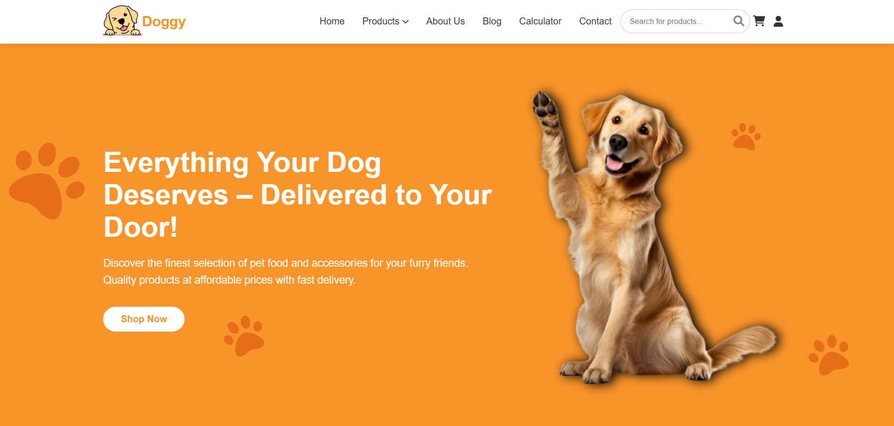
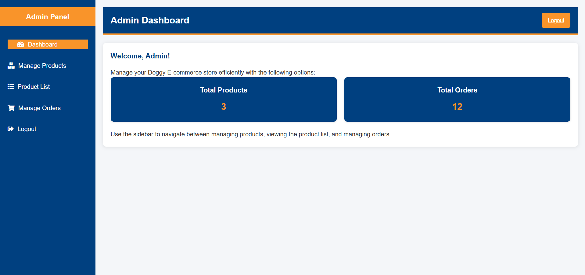

# E-commerce Website

A complete e-commerce platform for pet supplies with user authentication, product catalog, shopping cart, and more.
[Live Demo](https://dogkart.onrender.com) 🚀

## Features

- 🛍️ **Product Catalog**
  - Categories: Food & Nutrition, Dog Accessories, Dog Health
  - Product pages with images, descriptions, and pricing
  - Search functionality

- 👤 **User Authentication**
  - User registration and login
  - Session management
  - Protected routes

- 🛒 **Shopping Cart**
  - Add/remove products
  - Quantity adjustment
  - Cart persistence using sessions

- 🖥️ **Admin Panel**
  - Product management
  - Order management
  - User management

## Technologies Used

### Frontend
- HTML5, CSS3, JavaScript
- Font Awesome for icons
- Responsive design with media queries

### Backend
- PHP (v7.4+)
- MySQL Database
- Session management

---

## 📝 License

This project is open-source and free to use. Feel free to fork, modify, or contribute.

This project is licensed under the [MIT License](LICENSE).

---

⭐️ **Thank you for visiting my E-commerce project!** If you like this project, don’t forget to give it a star!
